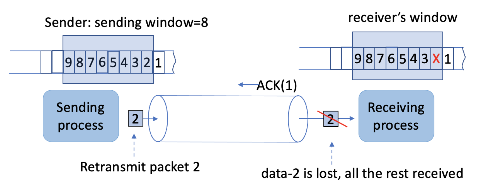

## QUIC协议快速一览

### 🍎写在开始

本文只是一个引子，主要用于那些想要快速上手QUIC但是不想理解设计理念，但是呢，又想知道大致实现的人来阅读。（我参考的文章就是这么说的啦！

具体的实现可以参考本文最后的RFC，比较长，大概有几十页，某些细节可以去详细阅读试试看，对于有争议或者翻译不出来的地方，会直接放原文。

在这里区分一下`拥塞控制(Congestion Control)`和`流量控制(Flow Control)`，二者均是网络控制的组成，但是很多文章会淡化二者概念。

拥塞控制用于**网络**，流量控制用于**接收端**。详细来说，拥塞控制是为了避免因为发送过多数据导致网络爆照进而导致整个链路瘫痪的引入的“利他”设计。而流量控制是为了确保接收方缓冲区不会因为发送方发送过多而炸掉引入的“自保”策略。

### 🍐前言 

本文不会详细地介绍QUIC(发音: kwik，同quick)的机理，或者它的一些实现细节，而且那也太多了。本文侧重于描述QUIC设计的核心思想。

最开始会介绍一下TCP协议，因为它的用途很广，同时也会谈论这个协议出现的一些问题；同时也会讨论一些试图解决这些问题的新型协议，并从中得到启发。

然后我们会详细地介绍本文的主角——QUIC协议，并尝试从它的核心设计理念展开论述，包括：

- 对于连接以及安全设置的整合；
- 独立于IP地址的连接标识符以及连接状态持久化功能；
- 针对拥塞控制和可靠传输而分开设计的窗口机制；
- 以及对于应用程序的松耦合。

### 🍊传输层协议

这里应该指的是可靠性传输协议，而不包括UDP这种，原文中作者进行了分开叙述。

#### 🍋TCP协议

作为一个传输层协议，TCP协议主要完成以下三个功能：

- 使用端口号实现多路复用/分解(注：TCP是四元组标识)
- 通过窗口，序列号，ACK等机制提供可靠字节流传输
- 通过拥塞控制限制网络中的包数量

关于多路复用/分解。连接是面相进程的，但是链路是面相主机的，这点很重要，即链路根据host建立两个主机之间的连接，但是主机内部多个进程之间则是通过端口号进行区分的，所以同一个主机不同的进程拥有不同的端口号，就是为了实现链路的复用。这样发送到同一个主机的包可以根据端口号的不同，分发到不同的进程上，而TCP是通过两个IP+两个Port这种四元组形式定义的，所以它实现了多路复用，多路分解就是把不同端口的数据通过同一个链路发出。

首先，TCP通过端口号机制构建了具名应用/服务与底层协议之间的联系，因为TCP是一个四元组来确定唯一链接的机制，所以不同的远程进程和服务器进程之间有一个独一无二的连接存在。简而言之，TCP通过`远程IP+Port+目标IP+Port`提供了唯一连接机制。

其次，TCP通过协商初始序列号，并通过在唯一的链接中传输的数据追加单调递增的序号来实现可靠数据传输，加上累加确认，随机化初始序列号等机制来确保可靠性。但是因为三次握手的存在，导致数据传输前出现了一次往返延迟。

最后，TCP引入了拥塞控制来限制网络中包的数量，但是这不是TCP标准的一部分，通过一堆复杂的机制和窗口限制了发送方发送数据的大小。

#### 🍌TCP存在的问题

- 拥塞控制和可靠传输的耦合度过高
    - 对于拥塞控制的实现依赖于窗口机制，但是这个窗口原本是拿来做流量控制和可靠传输的，所以就导致窗口的滑动会因为丢包的发生而推迟。如下图所示，仅仅丢失一个2号，而导致整个就绪(发送方)窗口无法移动，即使网络空闲。
- 队头阻塞
    - 因为某个包的丢失导致内核等待丢失包到来，进而进行重排序，然后才能递交给上层，即使此时后面的包都到了。
- 连接建立产生的不必要时延
    - 因为三次握手的存在，所以发送数据之前一定存在一次RTT延迟
- 固定协议头带来的限制
    - 历史原因导致的一些字段不再使用，和一些字段不满足互联网需求
- 基于IP地址实现唯一连接标识符带来的不足
    - 因为NAT，移动网络等存在，导致基于IP的连接随时断开并重连，而TCP是需要IP地址的，所以会有很多无用的三次握手发生

拥塞控制的耦合影响的是**发送端**。即网络空闲，但是因为可靠传输的存在阻止了拥塞窗口的滑动，进而无法发送更多的数据，注意拥塞控制作用于网络，因此一旦网络空闲就应该发送数据才对。

队头阻塞影响的是**接收端**。对于那些允许丢包的应用来说，数据应该达到即可用。这点在HTTP/2的TCP队头阻塞很明显，H1.1解决了一次请求一个连接问题，H2解决了HTTP 队头阻塞问题，注意是HTTP，H3解决了H2的TCP队头阻塞问题，注意是TCP。

#### 🍉其他传输层协议

这里给出原文，需要的读者可以自行查阅，不是很复杂，基本都是在对症下药：

- T/TCP

> T/TCP. Transaction TCP[4] was developed to sup- port distributed applications with frequent realtime transac- tions, without paying the cost of delay and overhead from TCP’s connection setup process. T/TCP keeps the connection state after the initial establishment, namely the connection identifier with associated sequence number of both ends. Keeping a persistent connection state adds additional sys- tem memory cost, but avoids the 3-way handshake delay for subsequent short transactions, which may be separated by long idle time periods in between.

- SCTP

> SCTP. The design of Stream Control Transmission Protocol (SCTP) [18] preceded QUIC by 10+ years. Its design addresses three of the identified TCP issues.
>
> For TCP issue #2 Head-of-Line-Blocking, SCTP allows each SCTP connection to contain multiple data substreams, removing the head-of-line blocking problem between the data belong to different substreams. A lost packet of substream- 1 will not block SCTP from passing to the application the received data for substream-2, confining the HOL problem to be with each substream, which is still delivered in-order. However, SCTP does not fully address the HLB problem. Each SCTP connection uses a single TSN (Transmission Sequence Number) for both reliable delivery and congestion control, in the same was as TCP does. Therefore, when the TSN window is blocked by lost packets, the sender cannot send any new data for any substream, suffering a similar problem as TCP.
>
> For TCP issue #4, SCTP defined multiple typed chunks, each chunk has its own defined header formate; and multiple chunks can be packed into a single SCTP packet within the MTU limit. Each connection management command, e.g. setup, tear-down, reset, etc., is defined as a separate control chunk, so is the Selective ACK. Application data are carried in data chunks as ADUs, each identified by [stream ID, stream seq#]3. This design gives SCTP flexibility of defining new connection management commands by simply adding a new chunk type.
>
> SCTP partially addressed TCP issue #5 on IP address changes. Each end of a SCTP connection (called an asso- ciation) can have multiple IP addresses, and the set may change during the connection’s lifetime. Nevertheless, SCTP connection identifiers are still bound to IP addresses.

- RTP

> RTP. As its name suggested, Real-time Transport Pro- tocol (RTP) [9] is designed to support real time applications, such as video conferencing. Real-time multimedia streaming applications require timely delivery of data, and to achieve this primary goal it can tolerate packet losses to certain degree. The protocol also provides facilities for multicast packet delivery and jitter compensation. Due to its radically different purposes and requirements from previous trans- port protocols which focus on reliable data delivery, RTP pioneered a few new concepts in transport protocol designs.
>
> First, RTP is the first widely used transport protocol that runs over UDP, resulting in RTP implementation being out- side the kernel. UDP [16] can be viewed as a NO-OP transport protocol other than using port numbers to demultiplex in- coming packets to intended application processes, and an optional checksum. However, UDP does offer a likely unno- ticed but a rather important advantage: it allows applications to control what data to be packaged into each IP packet, thus enabling the realization of the application data unit (ADU) [7]. This user space implementation allows RTP to be tightly inte- grated with the application implementations to utilize ADU.
>
> Second, RTP is the first widely used transport protocol that uses IP multicast delivery. A multicast RTP session is identified by the IP multicast address plus a pair of UDP port (one for RTP, one for RTCP). Furthermore, RTP data packets carry timestemps and sequence numbers, the former for media replay and the latter for detecting losses.

#### 🍇安全传输层协议(TLS和DTLS)

简单叙述一下TLS。

TLS是建立在TCP之上的协议，你可以把它看成是跑在应用层的传输层协议来看，因为你的应用只会通过它做加密传输而不是直接操作它，在你的眼中它的作用和TCP差不多，但是它是跑在应用层的。

关于TLS握手，交换Hello数据，证书签发等等这里不展开叙述。

如果对证书签发感兴趣，可以去看看`证书链`和`X509证书格式`。

DTLS则是基于UDP实现的TLS，底层也模拟了一些TCP行为来实现可靠传输，但是意义不大，这里不再展开。

> Datagram Transport Layer Security (DTLS) protocol [8] is designed to secure applications that use UDP as the trans- port protocol. The basic design philosophy of DTLS is to construct “TLS over datagram transport”. TLS requires reli- able packet delivery and cannot be used directly in datagram environments where packets may be lost or reordered. DTLS makes only the minimal changes to TLS required to fix this problem. DTLS uses a simple retransmission timer to handle packet loss, a sequence number to handle network packet re-ordering, and performs its own message fragmentation and reassembly when needed. In essence, DTLS performs all the tasks of TLS with its own TCP-equivalent reliability sup- port. As a result, using DTLS to secure application datagrams require multiple round trips.

#### 🍓小结

基于上面对于TCP的考察，我们认为新的协议应该具有如下功能，以及实现这些功能需要考虑到的问题，注意到，现在主流的协议都是使用端口号实现多路复用/分解的，这点我们也会论述一下：

- 定义连接标识符和数据标识符
- 传输连接管理，包括：
    - 全局唯一的连接ID，要求连接独立于IP地址，但是连接又必须映射到IP地址
    - 连接状态设置和关闭
    - 控制信息交换机制，方便灵活地设定控制信息
    - 对于可变IP地址的支持，因为移动或者多路由又或者NAT的存在导致
- 可靠数据传输，包括：
    - 唯一数据标识符，必须可以在两端之间可靠传输
    - (基于)窗口(的)流量控制，避免前面提及的队头阻塞问题
- 拥塞控制
- 安全，一般认为是加密连接

### 🫐QUIC连接

QUIC连接是一个在两端之间共享的**状态**，且它基于UDP实现，因为TCP内嵌在内核，所以更新迭代不方便，而借助UDP可以把更多的控制权拿捏在用户空间，讲白了更灵活。

#### 🍈连接ID

QUIC使用连接ID作为连接标识符，且这个ID由两个对端共同组成，而且可以应付底层IP变化，同时可以提供类似TCP的多路复用/分解的功能。

#### 🍒握手

QUIC把加密握手和数据传输整一块了，这样就可以只在一个RTT时间内完成，也即，QUIC在进行TLS1.3密钥交换时一并进行了传输认证交换。

QUIC使用`初始包`来进行连接ID确认，即双端各发送一个ID，拼接起来就是此次连接的ID。此外初始包做的事不仅仅是商榷连接ID，而且会交换TLS加密用的随机串，而加密用的秘钥就从这里生成。同时二者确定的连接ID会在TLS握手阶段验证，以上过程发生在一个RTT时间内。

QUIC也允许客户端通过之前的连接进行0RTT请求，但是这可能引入重播攻击的风险。

#### 🍑连接迁移

连接迁移发生在底层IP变化时，此时客户端将从新的IP地址发送一个包(复用同一个连接ID)，以此来告诉远端它的地址发生了变化，远端会发送一个验证包，以此来验证这个请求真的拥有这个新地址的所有权。

一般来说这个包包含一个随机串，而客户端仅需要简单的重复一下并回复即可。然后双端继续通信即可。有时为了避免跨网络跟踪，服务端也可以给迁移后的客户端一个新的连接ID。

QUIC还允许在握手阶段迁移服务端地址，比如握手时服务端是地址A，握手后服务端要求客户端去请求地址B，而后，客户端执行一次地址验证(同上)，并且在地址B开启后续的操作。

连接迁移的触发，以Client-Server举例，当Server发现来自某一ConnectionID的包的IP不同于之前记录的时，便知道对端IP变化了，此时会发送探测包通知对端且触发验证，并且把积攒的响应回送过去。但是如果Client不主动发送消息，Server则无法通知IP地址的变化。

### 🥭QUIC包(Packet)

#### 🍍包结构

不同于TCP固定大小的包头，QUIC的包头大小可变，一般来说是建立连接时涉及到更多的参数，而连接建立之后的包头会小一些，小包头的普通包的包头如下所示：

其中，不同的帧类型不一定一样，但是不能超过MTU的大小。QUIC中的包，每一个都被赋予了一个不同的数字，而且是单调递增的，指出了包的发送顺序，并且和ACK解耦，即重传的包拥有新的序号，而不是原本的序号，这方便并且可以更加准确地测量网络延时。

同时QUIC也有`累计确认`机制，但是它同时会在它的ACK帧包含SACK，准确地指出缺失了那些包；并且QUIC的ACK帧更大，所以可以包含多大256组SACK；通过这种方式，QUIC可以在多次响应中包含重复的SACK，以此来提升包记录和丢失的灵活性。

- 最大Ack表示发送端已确认的最大包序号，在估算RTT和丢包检测时会用到
- AckRange指出了在最大Ack前的，连续已确认的包的序号
- Gap指出了已确认包之前的，连续未确认的序号

#### 🥥流(Stream)

QUIC的流机制参考了HTTP/2的一些实现。QUIC把应用数据拆分成帧，并把不同的帧组装进包进行传输。不仅仅连接有ID，包有自增ID，流也有ID，组成流的帧依旧有ID(准确的说是标识符)。流ID很好理解，帧标识符指的是`StreamID+FrameOffset`，即流ID和帧在此流中的偏移量。

流ID中有两个bit用来指出这个流是哪方发出的，以及是单向还是双向的。

流就好比TCP连接，而帧就是TCP的报文段，帧的标识符就是TCP报文段的序列号。帧的标识符用于重排序，丢失检测，重传选择等，就和TCP的序列号差不多功能。

QUIC把不同的应用层数据归档到不同的流，从流拆分进不同的帧，然后把帧封装进包(所以一个包可以包含来自不同流的帧)，发送出去。

QUIC端可以决定不同帧的传输优先级，比如一些重传或者控制帧会优先传输，这可以提高丢失恢复，拥塞控制，流量控制的性能。

前面提到，H2具有TCP队头阻塞，即请求1的流卡住了，但是请求2，请求3都到达了，也没法提交给上层。而QUIC则不会因为某个包丢失而影响所有的流，仅仅阻塞这个包包含的帧所涉及到的流。

> When a packet is lost, only the streams with data frames contained in the packet will need to wait for the retransmission of the lost frames. It will not block other streams from moving forward.

#### 🥝不可靠报文段传输

这里说一下，原文是`Datagram Delivery`，即`数据报传输`。但是准确来说数据报是网络层用语(IP数据报)，传输层的分段应该统称为`报文段`，但是很多时候会拿数据报特指`UDP`协议的分段，报文段或者流特指`TCP`的分段，这是不对的。所以这里我们尊重《计算机网络：自顶向下》这本书的原则，进行了替换，即传输层的分段统称为报文段。

QUIC的底层依赖UDP，但是在自己的封装里，实现了针对UDP的可靠加密传输，在传输报文段时追加ACK机制，以此来保证可靠性。

### 🍅QUIC恢复

#### 🍆估算往返时间(RTT)

QUIC因为包的序号递增特性，解决了TCP在计算RTT时因为不确定ACK是重传ACK还是原始ACK而估算错误的问题，这个展开来会复杂一点，涉及到三个RTT时间采样分析，详见相关的RFC。

#### 🥑拥塞控制

QUIC解耦了拥塞控制和可靠传输控制。

包序号实现拥塞控制，流ID和偏移量(也就是帧标识符)实现可靠传输控制。

QUIC没有闭门造车，它使用类似TCP的基于窗口的拥塞控制，但是它没有给出具体的拥塞控制算法的实现，相反，它把这种实现交给了用户去完成，不过总有一个默认的。

一般来说，窗口不会自动缩小，除非发生了`持续拥塞`。持续拥塞的定义为：如果两个包的ACK丢失且它们之间任何包的ACK都丢失了，且这两个包发送的时间差超过RTT估算值(取决于那三个RTT)，则认为发生了持续拥塞。

QUIC的发送方会调整发送的频率，以此来减少发生`短期拥塞`的可能性。其实就是确保包发送的间隔超过一个阈值，这个阈值根据平均RTT，窗口大小，数据包大小计算得到。

#### 🥦丢失检测和恢复

QUIC的帧就好像IP数据报，而包就像一个数据报集合一样，某个ACK到达，则认为这个ACK对应的包其内部所有的帧都到达了。

针对丢包检测，QUIC要求满足：后发的包ACK到达且达到某个阈值。

QUIC给出了两种阈值类型：

- 基于包序号：因为丢包时会发生后面的包的ACK先到达(更大的ACK先到达)，所以给定一个阈值T，当前以ACK的最大值为X，则认定所有序号小于X-T的未ACK的包为丢失状态。
- 基于时间：这个就简单了，给定一个基于RTT估算出来的大致时间T，选定一个已经ACK的包到达时间为X，则所有在X-T之前未收到ACK的包认为丢失。

同时上述阈值会保留用于重排序的时间，以及尝试减少因为检测到丢包而处罚拥塞控制进而降低性能的可能。

为了探测尾包的丢失，任何要求ACK的包被发送之后，都会初始化一个探针计时器，当探针计时器超时，会再次发送一个探针包。（这里原文读起来有点不通顺

> To detect the loss of tail packets , QUIC will initialize a timer for the Probe Timeout (PTO) period whenever a packet requiring acknowledgment is sent, which includes the estimated network RTT smoothed_rtt, the variation in the RTT samples rttvar, and the maximum time a receiver might delay sending an acknowledgment. When the PTO timer expires, the sender will send a new packet requiring acknowledgment as a probe, which could repeat some in- flight data to reduce the number of retransmissions.

当丢失检测被触发，丢失的帧会被封装进新的包并附加新的包序号，然后发送。

借助丢失检测和恢复，QUIC提供了类似TCP可靠传输流服务。

### 🥬QUIC安全

QUIC和TLS的关系就好比，TLS为QUIC提供了加密策略和握手方式，而QUIC为TLS提供了可靠传输的底层服务。

在阐述这一块之前，需要引入一些概念。

公钥加密，私钥解密：用于确保数据不可见。常见的RSA算法就是如此，一般发送方持有公钥，接收方持有私钥。

公钥解密，私钥加密：用于验证用户身份。X509证书体系就是如此，一般CA持有私钥，公钥写在证书里，确保证书不被篡改。

**非对称加密的公私钥作用可以互换**，即私钥加密，公钥解密，一般会用来验证证书签算是否是公钥持有者完成的，但是一般不会这么做。

这里多提一下数字证书，以X509为例，证书是一个链式结构，即当前证书包含需要的加密公钥，用于加密数据传输，而验证此证书的解密公钥在上级证书中，以此类推，直到根证书(存在操作系统或者浏览器里)。除了叶子证书之外，每一个证书都包含用于验证下级证书身份的解密公钥；叶子证书包含用于应用层数据的加密公钥。

此外不是所有的证书+TLS都是走加密公钥+RSA算法的，有一些用的是[DH算法](http://wsfdl.com/algorithm/2016/02/04/理解Diffie-Hellman密钥交换算法.html)。

DH算法大概就是暴露四个数字：p，q，A，B，双端分别保留a，b。通过p+A+b或p+B+a(q也可以，只要选择一样就行)可以得到一样的K。然后两端走K进行对称加密即可。

QUIC走的是DH。如果走DH就一定涉及到交换p，q的过程，而A，B的生成依赖p，q。QUIC为了减少多出来的交换，使用了K迁移策略。

在讨论这个之前，先来看看使用RSA的TLS拿证书干了什么。在此时的证书结构中，证书包含的公钥，是RSA算法的加密公钥，客户端通过它来加密随机串。

为了减少RTT，服务端会索性把p，q一起生成(俩素数)，并且生成一个随机数，用作a；通过p，q和a生成A，然后把{p, q, A}三个丢给客户端。注意，此时的{p, q, A}是拿私钥签名过的，然后客户端会拿公钥解密，如果一致说明这个{p, q, A}确实是证书所属的服务端签发的。

为什么使用DH而不是用RSA呢？因为DH可以通过K迁移实现前向攻击保护，即每次开启连接会根据K得到新的会话K，这样可以保证在服务端私钥泄露时，不会因为历史消息被记录而被破解，因为每段都有新的K。

当然RSA也有类似的机制，这里不展开了。

此外关于DH算法，前面说了为了避免前向攻击问题，每次都会使用心得DH密钥对，所以称为DHE(Ephemeral Diffie-Hellman)，即临时DH。当然了QUIC会从一个固定的DH过渡到这里。

#### 🥒QUIC加解密握手

此时QUIC的握手就会清晰很多了。QUIC把上述很多步骤合并在一起，以此来减少RTT。过程如下：

- 1⃣️最最开始，服务器启动时，生成{p, q, 自己的私钥a，自己的公钥A}并保存，长久使用

- 2⃣️客户端发起ClientHello，包含支持的密码组合，QUIC传输参数，还有一些用于TLS的扩展参数
- 3⃣️服务端返回ServerHello，包括证书，选取的密码组合(一般是DHE)，以及使用私钥签名之后的{p, q, 服务端DH公钥(A)}，结束消息。
- 到这里1-RTT
- 4⃣️客户端通过证书获取公钥并验证签名{p, q, A}，生成自己的私钥b，并根据得到的{p, q}生成公钥B，然后根据A，自己的私钥b，和{p, q}得到K，通过K加密消息，进行通信，同时发送自己的公钥B
- 5️⃣服务端通过{p, q, B, a}得到K。开始K迁移，为了避免前向攻击。
- 6⃣️服务端生成新的随机私钥aa，并得到新的公钥AA，然后通过{p, q, aa, B}得到KK，之后使用KK传输数据，同时把AA传给客户端
- 7⃣️客户端收到KK并通过{p, q, b, AA}得到KK，解密数据，然后继续传输，避免了前向攻击

所谓的0-RTT即提前保存了{p, q, A}，下次直接进入到第4️⃣步。

#### 🌶认证机制和被加密的消息头以及消息载体

QUIC并不是全部加密的，相反，它会选择加密部分数据，比如消息载体，但是消息头为了性能和快速读取，不会进行加密操作。

### 🫑原文

[链接🔗](https://web.cs.ucla.edu/~lixia/papers/UnderstandQUIC.pdf)

### 🌽参考

[QUIC的RFC](https://www.rfc-editor.org/rfc/rfc9000.html#name-packets-and-frames)

[QUIC是如何做到0RTT的](https://zhuanlan.zhihu.com/p/142794794)

[一篇文章搞懂密码学基础及SSL/TLS协议](https://catbro666.github.io/posts/e92ef4b4/)

